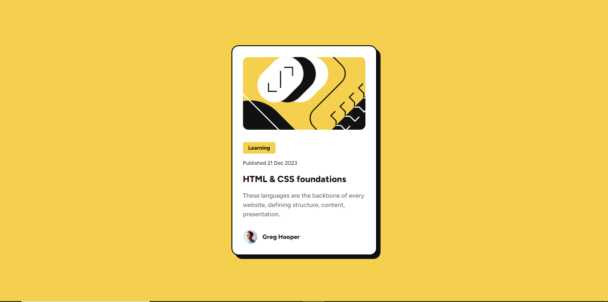

# Frontend Mentor - Blog preview card solution

This is a solution to the [Blog preview card challenge on Frontend Mentor](https://www.frontendmentor.io/challenges/blog-preview-card-ckPaj01IcS). Frontend Mentor challenges help you improve your coding skills by building realistic projects. 

## Table of contents

- [Overview](#overview)
  - [The challenge](#the-challenge)
  - [Screenshot](#screenshot)
  - [Links](#links)
- [My process](#my-process)
  - [Built with](#built-with)
  - [What I learned](#what-i-learned)
  - [Continued development](#continued-development)
  - [Useful resources](#useful-resources)
- [Author](#author)
- [Acknowledgments](#acknowledgments)


## Overview

### The challenge

Users should be able to:

- See hover and focus states for all interactive elements on the page

### Screenshot




### Links

- Solution URL: [Add solution URL here](https://your-solution-url.com)
- Live Site URL: [Add live site URL here](https://your-live-site-url.com)

## My process

### Built with

- Semantic HTML5 markup
- CSS custom properties
- Flexbox
- Mobile-first workflow
- SASS


### What I learned

Since I used SASS in styling, I solidified my knowledge in the use of @extend, @mixin, @include rules to make styling seamless.

``sass (.scss)
proud of this

@mixin text_edit($font-size, $fontweight, $font-family){
	font-size: $font-size;
	line-height: 150%;
	letter-spacing: 0px;
	font-weight: $fontweight;
	font-family: $font-family;
}

```

### Continued development

I would work on using operators in SASS next

## Author

- Website - [Adesanya ifeoluwa](https://www.your-site.com)
- Frontend Mentor - [@Ifehj](https://www.frontendmentor.io/profile/Ifehj)
